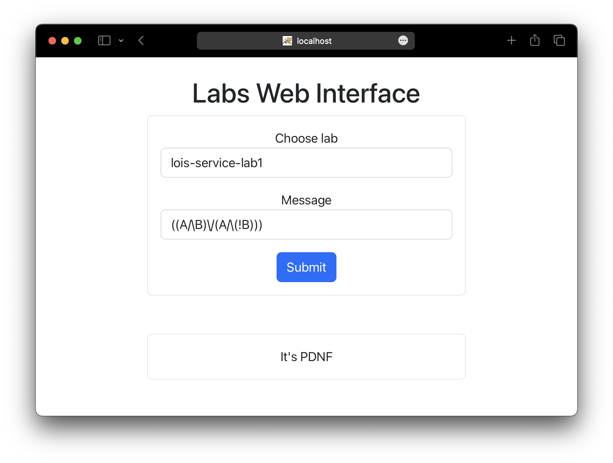

# Labs Web Interface

The point of this repository is to make a microservice application for labs submitting, where each lab is an independent service (rest server).



## Run

Run interface:

```shell
git clone https://github.com/glebchanskiy/labs-interface
cd labs-interface

npm start
```

(localhost:8080)

<br/>

Run microservices application [gateway](https://github.com/glebchanskiy/labs-gateway-service):

```shell
git clone https://github.com/glebchanskiy/labs-gateway-service
cd labs-interface

./mvnw package
java -jar target/labs_interface-0.0.1-SNAPSHOT.war
```

(gateway service redirects requests to the required services)

<br/>

## Labs-services

After running labs-interface and gateway-service, you can launch the required lab services. Now available:

- [lois-service-lab1](https://github.com/glebchanskiy/lois-service-lab1)

- [aois-service-lab3](https://github.com/glebchanskiy/aois-service-lab3)
